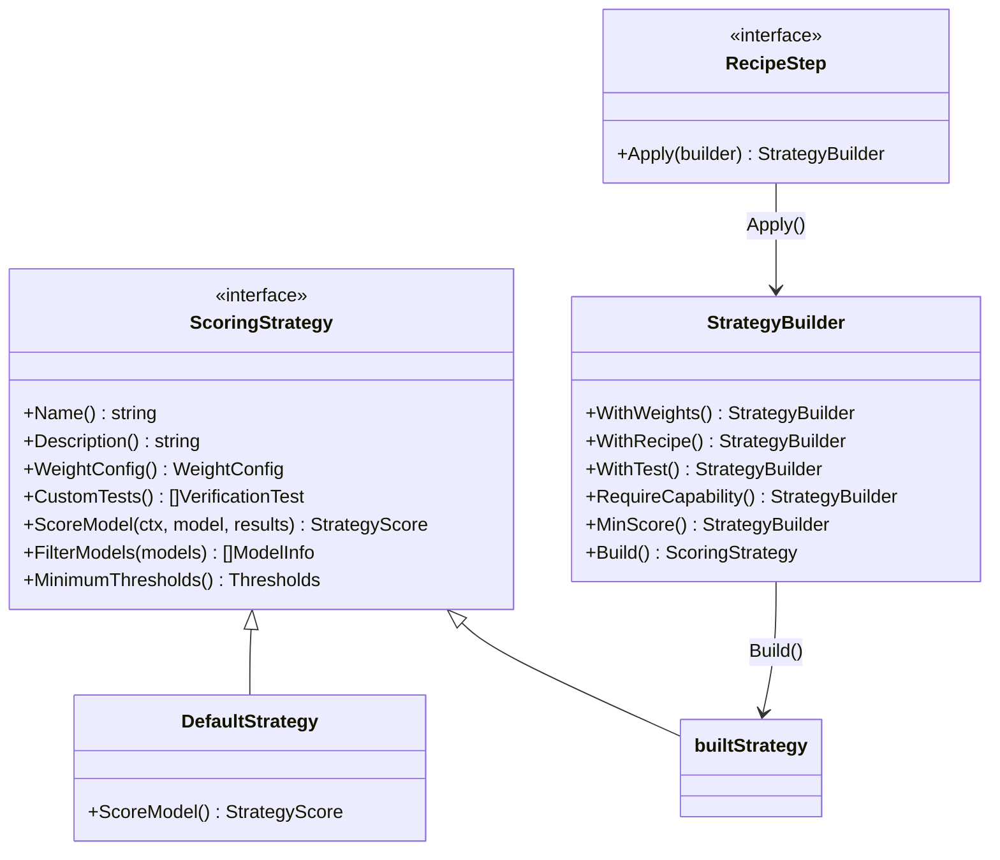

# Strategy Pattern Guide

## Overview

The Strategy pattern allows pluggable scoring mechanisms for LLM verification. Instead of hardcoded scoring weights, strategies define custom weight configurations, verification tests, model filters, and minimum thresholds.

## Architecture



## Quick Start

### Using DefaultStrategy (existing behavior)

```go
v := llmverifier.New(cfg)
// Existing function — unchanged
ps, details := v.CalculateScores(result)

// New function — same behavior via strategy
strategy := llmverifier.NewDefaultStrategy()
score, err := v.CalculateScoresWithStrategy(result, strategy)
```

### Building a Custom Strategy

```go
strategy, err := llmverifier.NewStrategyBuilder("helix-qa").
    WithDescription("Optimized for autonomous QA sessions").
    WithWeights(llmverifier.WeightConfig{
        Responsiveness:       0.15,
        CodeCapability:       0.10,
        FeatureRichness:      0.15,
        Reliability:          0.20,
        VisionCapability:     0.25,
        InstructionFollowing: 0.15,
    }).
    WithRecipe(recipes.VisionTest()).
    WithRecipe(recipes.InstructionFollowingTest()).
    RequireCapability("vision").
    MinScore(0.6).
    Build()
```

### Running Verification with Strategy

```go
results, scores, err := v.VerifyWithStrategy(ctx, strategy, models)
for i, score := range scores {
    fmt.Printf("Model %s: %.2f (passed: %v)\n",
        results[i].ModelInfo.ID, score.Overall, score.Passed)
    // Convert for backward compat
    ps := score.ToPerformanceScore()
}
```

## Weight Dimensions

| Dimension | DefaultStrategy | QA Strategy | Description |
|-----------|----------------|-------------|-------------|
| Responsiveness | 0.30 | 0.15 | Response speed |
| CodeCapability | 0.25 | 0.10 | Code generation quality |
| FeatureRichness | 0.25 | 0.15 | Feature support breadth |
| Reliability | 0.20 | 0.20 | Consistency and uptime |
| VisionCapability | 0.00 | 0.25 | Screenshot analysis |
| InstructionFollowing | 0.00 | 0.15 | Action precision |

Weights must sum to 1.0 (validated by `WeightConfig.Validate()`).

## Capability Filtering

`RequireCapability()` maps to `ModelInfo` fields:

| Capability | ModelInfo Field |
|-----------|----------------|
| `"vision"` | `SupportsVision` |
| `"audio"` | `SupportsAudio` |
| `"video"` | `SupportsVideo` |
| `"reasoning"` | `SupportsReasoning` |
| `"streaming"` | Always passes |
| Other | Checked against `Tags` |

## Backward Compatibility

- `Verify()` unchanged — uses hardcoded weights
- `CalculateScores()` unchanged — same signature and behavior
- `VerifyWithStrategy()` — new parallel entry point
- `CalculateScoresWithStrategy()` — new strategy-aware scoring
- `DefaultStrategy` produces identical score weights to existing code
