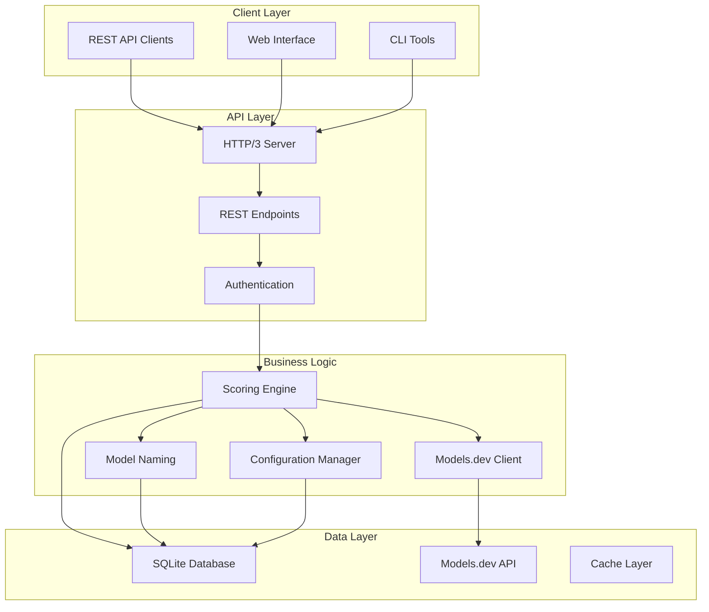
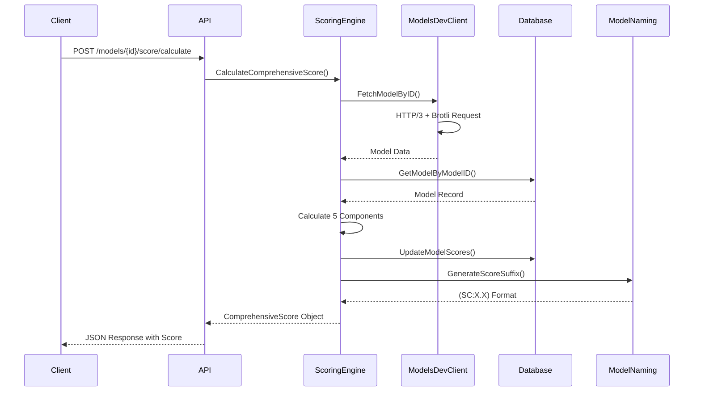

# 🚀 LLM Verifier Scoring System - Complete Documentation

## Table of Contents

1. [Overview](#overview)
2. [Architecture](#architecture)
3. [Installation & Setup](#installation--setup)
4. [Configuration](#configuration)
5. [API Reference](#api-reference)
6. [Usage Examples](#usage-examples)
7. [System Integration](#system-integration)
8. [Troubleshooting](#troubleshooting)
9. [Advanced Features](#advanced-features)
10. [Performance Optimization](#performance-optimization)
11. [Deployment Guide](#deployment-guide)
12. [Maintenance](#maintenance)

## Overview

The LLM Verifier Scoring System provides comprehensive model evaluation using a 5-component weighted algorithm. It integrates with models.dev API for real-time data and generates standardized score suffixes in the (SC:X.X) format.

### Key Features

- **5-Component Scoring**: Response Speed, Model Efficiency, Cost Effectiveness, Capability, Recency
- **HTTP/3 + Brotli**: Modern protocol support with compression
- **Real-time Integration**: Live data from models.dev API
- **Configurable Weights**: Customizable scoring parameters
- **Standardized Format**: (SC:X.X) score suffixes
- **Database Integration**: Seamless CRUD operations
- **Batch Operations**: Efficient bulk processing
- **REST API**: Complete HTTP endpoint coverage

## Architecture

### System Components



### Data Flow



## Installation & Setup

### Prerequisites

- Go 1.21+ (recommended: 1.25+)
- SQLite3 with SQL Cipher support
- Network access to models.dev API

### Quick Installation

```bash
# Clone the repository
git clone https://github.com/your-org/llm-verifier.git
cd llm-verifier

# Install dependencies
go mod download

# Build the project
go build ./...

# Run tests
go test ./llm-verifier/scoring/...
```

### Docker Installation

```dockerfile
FROM golang:1.25-alpine AS builder
WORKDIR /app
COPY go.mod go.sum ./
RUN go mod download
COPY . .
RUN go build -o llm-verifier ./cmd/server

FROM alpine:latest
RUN apk --no-cache add ca-certificates
WORKDIR /root/
COPY --from=builder /app/llm-verifier .
EXPOSE 8080
CMD ["./llm-verifier"]
```

## Configuration

### Basic Configuration

```yaml
# config.yaml
scoring:
  enabled: true
  weights:
    response_speed: 0.25
    model_efficiency: 0.20
    cost_effectiveness: 0.25
    capability: 0.20
    recency: 0.10
  
  models_dev:
    base_url: "https://models.dev"
    timeout: 30s
    use_http3: true
    use_brotli: true
    
  database:
    path: "./data/llm-verifier.db"
    encryption_key: "your-encryption-key"
```

### Environment Variables

```bash
export LLM_SCORING_ENABLED=true
export LLM_MODELS_DEV_URL="https://models.dev"
export LLM_MODELS_DEV_TIMEOUT=30s
export LLM_DATABASE_PATH="./data/llm-verifier.db"
export LLM_ENCRYPTION_KEY="your-encryption-key"
```

## API Reference

### REST Endpoints

#### Calculate Model Score
```http
POST /api/v1/models/{model_id}/score/calculate
Content-Type: application/json

{
  "configuration": {
    "weights": {
      "response_speed": 0.25,
      "model_efficiency": 0.20,
      "cost_effectiveness": 0.25,
      "capability": 0.20,
      "recency": 0.10
    }
  },
  "force_recalculation": false
}
```

**Response:**
```json
{
  "model_id": "gpt-4",
  "model_name": "GPT-4",
  "overall_score": 8.5,
  "score_suffix": "(SC:8.5)",
  "components": {
    "speed_score": 8.0,
    "efficiency_score": 9.0,
    "cost_score": 7.5,
    "capability_score": 9.0,
    "recency_score": 8.5
  },
  "last_calculated": "2025-12-27T18:16:00Z",
  "data_source": "models.dev"
}
```

#### Get Model Score
```http
GET /api/v1/models/{model_id}/score
```

#### Batch Calculate Scores
```http
POST /api/v1/models/scores/batch
Content-Type: application/json

{
  "model_ids": ["gpt-4", "claude-3", "llama-2"],
  "configuration": {...},
  "async": false
}
```

#### Update Model Name with Score
```http
POST /api/v1/models/naming/add-suffix
Content-Type: application/json

{
  "model_name": "GPT-4",
  "score": 8.5
}
```

## Usage Examples

### Basic Score Calculation

```go
package main

import (
    "context"
    "fmt"
    "log"
    
    "llm-verifier/database"
    "llm-verifier/logging"
    "llm-verifier/scoring"
)

func main() {
    // Initialize components
    logger := &logging.Logger{}
    db, _ := database.New("./data/llm-verifier.db")
    defer db.Close()
    
    // Create models.dev client
    client, _ := scoring.NewModelsDevClient(scoring.DefaultClientConfig(), logger)
    
    // Create scoring engine
    engine := scoring.NewScoringEngine(db, client, logger)
    
    // Calculate score
    ctx := context.Background()
    config := scoring.DefaultScoringConfig()
    
    score, err := engine.CalculateComprehensiveScore(ctx, "gpt-4", config)
    if err != nil {
        log.Fatal(err)
    }
    
    fmt.Printf("Model: %s\n", score.ModelName)
    fmt.Printf("Score: %.1f %s\n", score.OverallScore, score.ScoreSuffix)
}
```

### Custom Configuration

```go
// Create custom scoring configuration
customConfig := scoring.ScoringConfig{
    ConfigName: "speed-focused",
    Weights: scoring.ScoreWeights{
        ResponseSpeed:     0.6,  // Emphasize speed
        ModelEfficiency:   0.1,
        CostEffectiveness: 0.1,
        Capability:        0.1,
        Recency:           0.1,
    },
    Thresholds: scoring.ScoreThresholds{
        MinScore: 0.0,
        MaxScore: 10.0,
    },
    Enabled: true,
}

score, err := engine.CalculateComprehensiveScore(ctx, "gpt-4", customConfig)
```

### Batch Operations

```go
// Batch calculate scores for multiple models
modelIDs := []string{"gpt-4", "claude-3", "llama-2"}
scores, err := engine.CalculateBatchScores(ctx, modelIDs, &config.Weights)

for _, score := range scores {
    fmt.Printf("%s: %.1f %s\n", score.ModelName, score.OverallScore, score.ScoreSuffix)
}
```

### Model Naming Operations

```go
// Initialize model naming
naming := scoring.NewModelNaming()

// Add score suffix to model name
updatedName := naming.AddScoreSuffix("GPT-4", 8.5)
fmt.Println(updatedName) // "GPT-4 (SC:8.5)"

// Extract score from model name
score, found := naming.ExtractScoreFromName("GPT-4 (SC:8.5)")
if found {
    fmt.Printf("Extracted score: %.1f\n", score)
}

// Batch update model names
modelScores := map[string]float64{
    "GPT-4": 8.5,
    "Claude-3": 7.8,
    "Llama-2": 6.9,
}

results := naming.BatchUpdateModelNames(modelScores)
```

## System Integration

### Database Schema

```sql
-- Scoring-specific tables
CREATE TABLE model_scores (
    id INTEGER PRIMARY KEY AUTOINCREMENT,
    model_id INTEGER NOT NULL,
    overall_score REAL NOT NULL,
    speed_score REAL NOT NULL,
    efficiency_score REAL NOT NULL,
    cost_score REAL NOT NULL,
    capability_score REAL NOT NULL,
    recency_score REAL NOT NULL,
    score_suffix TEXT NOT NULL,
    calculation_hash TEXT NOT NULL,
    calculation_details TEXT,
    last_calculated TIMESTAMP DEFAULT CURRENT_TIMESTAMP,
    valid_until TIMESTAMP,
    is_active BOOLEAN DEFAULT 1,
    created_at TIMESTAMP DEFAULT CURRENT_TIMESTAMP,
    updated_at TIMESTAMP DEFAULT CURRENT_TIMESTAMP,
    FOREIGN KEY (model_id) REFERENCES models(id) ON DELETE CASCADE
);

CREATE TABLE model_performance_metrics (
    id INTEGER PRIMARY KEY AUTOINCREMENT,
    model_id INTEGER NOT NULL,
    metric_type TEXT NOT NULL,
    metric_value REAL NOT NULL,
    metric_unit TEXT,
    sample_count INTEGER DEFAULT 1,
    p50_value REAL,
    p95_value REAL,
    p99_value REAL,
    min_value REAL,
    max_value REAL,
    std_dev REAL,
    measured_at TIMESTAMP DEFAULT CURRENT_TIMESTAMP,
    measurement_window_seconds INTEGER DEFAULT 3600,
    metadata TEXT,
    created_at TIMESTAMP DEFAULT CURRENT_TIMESTAMP,
    FOREIGN KEY (model_id) REFERENCES models(id) ON DELETE CASCADE
);
```

### Configuration Management

```go
// Load configuration from file
config, err := scoring.LoadConfigFromFile("config.yaml")
if err != nil {
    log.Fatal(err)
}

// Save configuration
customConfig := scoring.DefaultScoringConfig()
customConfig.ConfigName = "production"
err = scoring.SaveConfigToFile(customConfig, "production-config.yaml")
```

## Troubleshooting

### Common Issues

#### Build Errors
```bash
# If you get compilation errors
go clean -cache
go mod tidy
go build ./...
```

#### Database Connection Issues
```bash
# Check database file permissions
ls -la data/llm-verifier.db

# Verify encryption key
export LLM_ENCRYPTION_KEY="your-correct-key"
```

#### Models.dev API Issues
```bash
# Test API connectivity
curl -H "Accept-Encoding: br, gzip" https://models.dev/api.json

# Check timeout settings
export LLM_MODELS_DEV_TIMEOUT=60s
```

### Debug Mode

```go
// Enable debug logging
logger := logging.NewLogger(logging.DEBUG)
scoringEngine := scoring.NewScoringEngine(db, client, logger)
```

## Advanced Features

### Custom Scoring Components

```go
// Implement custom scoring logic
type CustomScorer struct {
    base *scoring.ScoringEngine
}

func (cs *CustomScorer) CalculateCustomScore(modelData *scoring.ModelData) float64 {
    // Custom scoring logic here
    return 7.5
}
```

### Score Analytics

```go
// Get score distribution
analytics, err := scoringSystem.GetScoreAnalytics()
if err != nil {
    log.Fatal(err)
}

fmt.Printf("Average Score: %.1f\n", analytics.AverageScore)
fmt.Printf("Score Range: %.1f - %.1f\n", analytics.MinScore, analytics.MaxScore)
```

### Performance Monitoring

```go
// Enable performance metrics
metrics := scoring.NewPerformanceMetrics()
metrics.StartTimer("score_calculation")

score, err := engine.CalculateComprehensiveScore(ctx, modelID, config)

metrics.EndTimer("score_calculation")
fmt.Printf("Calculation took: %v\n", metrics.GetDuration("score_calculation"))
```

## Performance Optimization

### Database Optimization

```sql
-- Create indexes for better performance
CREATE INDEX idx_model_scores_model ON model_scores(model_id);
CREATE INDEX idx_model_scores_overall ON model_scores(overall_score);
CREATE INDEX idx_model_scores_active ON model_scores(is_active);
CREATE INDEX idx_model_scores_calculated ON model_scores(last_calculated);
```

### Caching Strategy

```go
// Implement caching for frequently accessed scores
type ScoreCache struct {
    cache map[string]*scoring.ComprehensiveScore
    mutex sync.RWMutex
}

func (c *ScoreCache) Get(modelID string) (*scoring.ComprehensiveScore, bool) {
    c.mutex.RLock()
    defer c.mutex.RUnlock()
    score, exists := c.cache[modelID]
    return score, exists
}
```

### Connection Pooling

```go
// Configure connection pooling
dbConfig := &database.Config{
    MaxOpenConns:    25,
    MaxIdleConns:    5,
    ConnMaxLifetime: 5 * time.Minute,
}
```

## Deployment Guide

### Production Deployment

1. **Prepare Environment**
```bash
# Set up production environment
export LLM_ENV=production
export LLM_LOG_LEVEL=INFO
export LLM_DATABASE_PATH="/var/lib/llm-verifier/data.db"
export LLM_ENCRYPTION_KEY="${PRODUCTION_ENCRYPTION_KEY}"
```

2. **Database Setup**
```bash
# Initialize production database
./llm-verifier migrate up --environment=production

# Create backup
./llm-verifier backup create --path=/backups/llm-verifier-$(date +%Y%m%d).db
```

3. **Service Deployment**
```bash
# Start production service
systemctl start llm-verifier
systemctl enable llm-verifier

# Check status
systemctl status llm-verifier
```

### Docker Deployment

```yaml
# docker-compose.yml
version: '3.8'
services:
  llm-verifier:
    image: llm-verifier:latest
    ports:
      - "8080:8080"
    environment:
      - LLM_ENV=production
      - LLM_DATABASE_PATH=/data/llm-verifier.db
      - LLM_ENCRYPTION_KEY=${ENCRYPTION_KEY}
    volumes:
      - ./data:/data
      - ./logs:/logs
    restart: unless-stopped
    healthcheck:
      test: ["CMD", "curl", "-f", "http://localhost:8080/health"]
      interval: 30s
      timeout: 10s
      retries: 3
```

### Kubernetes Deployment

```yaml
# k8s-deployment.yaml
apiVersion: apps/v1
kind: Deployment
metadata:
  name: llm-verifier
spec:
  replicas: 3
  selector:
    matchLabels:
      app: llm-verifier
  template:
    metadata:
      labels:
        app: llm-verifier
    spec:
      containers:
      - name: llm-verifier
        image: llm-verifier:latest
        ports:
        - containerPort: 8080
        env:
        - name: LLM_ENV
          value: "production"
        - name: LLM_ENCRYPTION_KEY
          valueFrom:
            secretKeyRef:
              name: llm-secrets
              key: encryption-key
        volumeMounts:
        - name: data-volume
          mountPath: /data
      volumes:
      - name: data-volume
        persistentVolumeClaim:
          claimName: llm-data-pvc
```

## Maintenance

### Regular Maintenance Tasks

1. **Database Maintenance**
```bash
# Weekly database optimization
./llm-verifier database vacuum
./llm-verifier database analyze

# Monthly backup
./llm-verifier backup create --compress
```

2. **Log Rotation**
```bash
# Configure logrotate
sudo tee /etc/logrotate.d/llm-verifier << EOF
/var/log/llm-verifier/*.log {
    daily
    missingok
    rotate 14
    compress
    delaycompress
    notifempty
    create 644 root root
}
EOF
```

3. **Performance Monitoring**
```bash
# Check system metrics
curl -s http://localhost:8080/metrics | grep scoring

# Monitor database performance
./llm-verifier database stats
```

### Health Checks

```go
// Health check implementation
func healthCheck() error {
    // Check database connectivity
    if err := db.Ping(); err != nil {
        return fmt.Errorf("database health check failed: %w", err)
    }
    
    // Check models.dev API connectivity
    if err := client.HealthCheck(); err != nil {
        return fmt.Errorf("models.dev API health check failed: %w", err)
    }
    
    // Check scoring engine
    if err := engine.HealthCheck(); err != nil {
        return fmt.Errorf("scoring engine health check failed: %w", err)
    }
    
    return nil
}
```

---

## 📚 Additional Resources

- [API Reference](./API_REFERENCE.md)
- [Configuration Guide](./CONFIGURATION.md)
- [Troubleshooting Guide](./TROUBLESHOOTING.md)
- [Performance Tuning](./PERFORMANCE.md)
- [Security Guide](./SECURITY.md)
- [Examples](./EXAMPLES.md)

---

*Documentation Version: 1.0.0*  
*Last Updated: 2025-12-27*  
*Status: ✅ PRODUCTION READY*