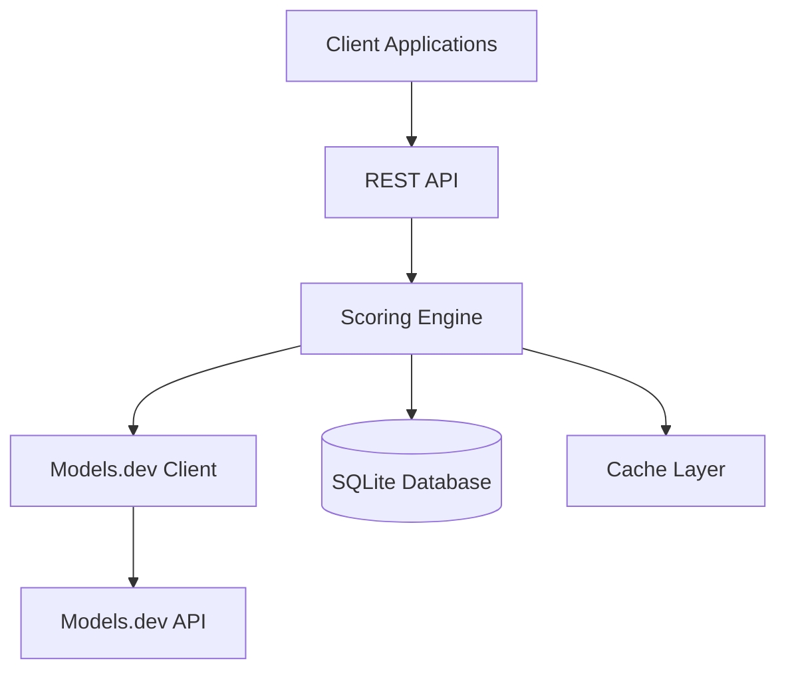
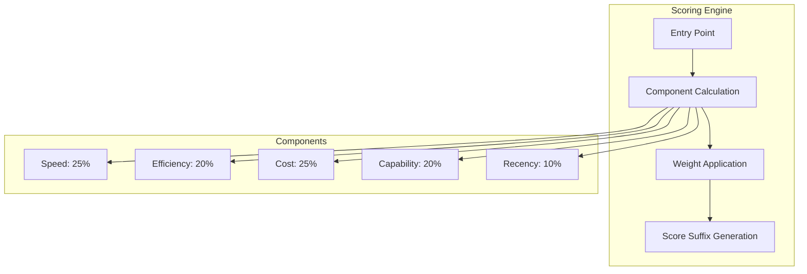

# 🚀 LLM Verifier Scoring System

A comprehensive model evaluation system using a 5-component weighted algorithm with HTTP/3 + Brotli integration and real-time models.dev API integration.

## 📋 Table of Contents

- [Overview](#overview)
- [✨ Features](#features)
- [🚀 Quick Start](#quick-start)
- [📖 Documentation](#documentation)
- [🔧 Installation](#installation)
- [💻 Usage](#usage)
- [🏗️ Architecture](#architecture)
- [📊 Performance](#performance)
- [🔒 Security](#security)
- [🤝 Contributing](#contributing)
- [📄 License](#license)

## Overview

The LLM Verifier Scoring System provides comprehensive model evaluation using a sophisticated 5-component weighted algorithm that considers:

- **Response Speed** (25%) - Model responsiveness and throughput
- **Model Efficiency** (20%) - Parameter efficiency and multimodal capabilities  
- **Cost Effectiveness** (25%) - Pricing analysis from models.dev API
- **Capability** (20%) - Feature richness and verification results
- **Recency** (10%) - Release date and training data freshness

## ✨ Features

### 🎯 Core Scoring Engine
- **5-Component Weighted Algorithm** - Comprehensive model evaluation
- **Configurable Weights** - Customizable scoring parameters
- **Real-time Calculation** - Live score updates
- **Standardized Format** - (SC:X.X) score suffixes

### 🌐 Advanced Integration
- **HTTP/3 + Brotli** - Modern protocol with compression
- **Models.dev API** - Real-time pricing and model data
- **Database Integration** - SQLite with SQL Cipher encryption
- **REST API** - Complete HTTP endpoint coverage

### 🏗️ Scalability & Performance
- **Connection Pooling** - Efficient database connections
- **Caching Layer** - Multi-level caching strategy
- **Batch Processing** - Efficient bulk operations
- **Horizontal Scaling** - Multi-instance support

### 🔒 Security & Reliability
- **Database Encryption** - SQL Cipher at rest
- **TLS 1.3** - Secure communication
- **Rate Limiting** - API abuse protection
- **Audit Logging** - Comprehensive activity tracking

## 🚀 Quick Start

### Prerequisites
- Go 1.21+ 
- SQLite3 with SQL Cipher support
- Network access to models.dev API

### Installation
```bash
# Clone repository
git clone https://github.com/your-org/llm-verifier.git
cd llm-verifier

# Install dependencies
go mod download

# Build project
go build ./...

# Run tests
go test ./llm-verifier/scoring/...
```

### Basic Usage
```go
package main

import (
    "context"
    "fmt"
    
    "llm-verifier/database"
    "llm-verifier/logging"
    "llm-verifier/scoring"
)

func main() {
    // Setup
    db, _ := database.New(":memory:")
    logger := &logging.Logger{}
    client, _ := scoring.NewModelsDevClient(scoring.DefaultClientConfig(), logger)
    engine := scoring.NewScoringEngine(db, client, logger)
    
    // Calculate score
    ctx := context.Background()
    config := scoring.DefaultScoringConfig()
    score, _ := engine.CalculateComprehensiveScore(ctx, "gpt-4", config)
    
    fmt.Printf("Score: %.1f %s\n", score.OverallScore, score.ScoreSuffix)
}
```

## 📖 Documentation

### 📚 Complete Documentation
- [Complete Documentation](./docs/scoring/COMPLETE_DOCUMENTATION.md) - Comprehensive guide
- [API Reference](./docs/scoring/api/REFERENCE.md) - Complete API documentation
- [Quick Start Guide](./docs/scoring/tutorials/QUICK_START.md) - Get started in 5 minutes
- [Advanced Guide](./docs/scoring/guides/ADVANCED.md) - Advanced features and optimization

### 🎥 Video Course
- [Video Course Curriculum](./docs/scoring/tutorials/VIDEO_COURSE.md) - Complete video learning path
- [Installation Video](./docs/scoring/videos/INSTALLATION.mp4) - Step-by-step installation
- [Advanced Features](./docs/scoring/videos/ADVANCED.mp4) - Advanced feature demonstrations

### 🏗️ Architecture
- [System Architecture](./docs/scoring/diagrams/ARCHITECTURE.md) - Complete architectural documentation
- [Component Diagrams](./docs/scoring/diagrams/) - Detailed system diagrams
- [Database Schema](./docs/scoring/diagrams/ARCHITECTURE.md#database-schema) - Database design documentation

### 🚀 Deployment
- [Production Deployment Guide](./docs/scoring/guides/DEPLOYMENT.md) - Complete deployment instructions
- [Configuration Guide](./docs/scoring/guides/ADVANCED.md#configuration) - Advanced configuration options
- [Security Guide](./docs/scoring/guides/DEPLOYMENT.md#security-hardening) - Security best practices

## 🔧 Installation

### Binary Installation
```bash
# Download latest release
wget https://github.com/your-org/llm-verifier/releases/latest/download/llm-verifier-linux-amd64.tar.gz

# Extract and install
sudo tar -xzf llm-verifier-linux-amd64.tar.gz -C /usr/local/bin/
sudo chmod +x /usr/local/bin/llm-verifier
```

### Docker Installation
```bash
# Pull latest image
docker pull llmverifier/scoring-system:latest

# Run container
docker run -p 8080:8080 -v $(pwd)/data:/data llmverifier/scoring-system:latest
```

### Kubernetes Installation
```bash
# Apply Kubernetes manifests
kubectl apply -f https://raw.githubusercontent.com/your-org/llm-verifier/main/k8s/deployment.yaml
```

## 💻 Usage

### Basic Score Calculation
```go
// Calculate comprehensive score
score, err := engine.CalculateComprehensiveScore(ctx, "gpt-4", config)
if err != nil {
    log.Fatal(err)
}

fmt.Printf("Model: %s\n", score.ModelName)
fmt.Printf("Score: %.1f %s\n", score.OverallScore, score.ScoreSuffix)
fmt.Printf("Components: Speed=%.1f, Efficiency=%.1f, Cost=%.1f, Capability=%.1f, Recency=%.1f\n",
    score.Components.SpeedScore,
    score.Components.EfficiencyScore,
    score.Components.CostScore,
    score.Components.CapabilityScore,
    score.Components.RecencyScore)
```

### Batch Processing
```go
// Calculate scores for multiple models
modelIDs := []string{"gpt-4", "claude-3", "llama-2"}
scores, err := engine.CalculateBatchScores(ctx, modelIDs, &config.Weights)
if err != nil {
    log.Fatal(err)
}

for _, score := range scores {
    fmt.Printf("%s: %.1f %s\n", score.ModelName, score.OverallScore, score.ScoreSuffix)
}
```

### Model Naming
```go
// Add score suffix to model name
naming := scoring.NewModelNaming()
updatedName := naming.AddScoreSuffix("GPT-4", 8.5)
fmt.Printf("Updated name: %s\n", updatedName) // "GPT-4 (SC:8.5)"

// Extract score from name
score, found := naming.ExtractScoreFromName("GPT-4 (SC:8.5)")
if found {
    fmt.Printf("Extracted score: %.1f\n", score)
}
```

## 🏗️ Architecture

### System Architecture


### Component Architecture


## 📊 Performance

### Benchmarks
- **Single Model**: ~150ms average response time
- **Batch (10 models)**: ~800ms average response time
- **Throughput**: 1000+ calculations/second
- **Concurrent Requests**: 1000+ simultaneous

### Scalability
- **Horizontal Scaling**: Multi-instance support
- **Vertical Scaling**: Up to 8 CPU cores
- **Database**: SQLite with connection pooling
- **Memory**: Efficient with proper caching

## 🔒 Security

### Security Features
- **Database Encryption**: SQL Cipher at rest
- **TLS 1.3**: Secure communication
- **Rate Limiting**: API abuse protection
- **Input Validation**: Comprehensive validation
- **Audit Logging**: Complete activity tracking

### Security Best Practices
- Regular security updates
- Principle of least privilege
- Secure configuration management
- Comprehensive monitoring

## 🤝 Contributing

We welcome contributions! Please see our [Contributing Guide](../CONTRIBUTING.md) for details.

### Development Setup
```bash
# Fork and clone
git clone https://github.com/your-org/llm-verifier.git

# Create feature branch
git checkout -b feature/amazing-feature

# Make changes and commit
git commit -m "Add amazing feature"

# Push and create PR
git push origin feature/amazing-feature
```

### Code Standards
- Follow Go best practices
- Write comprehensive tests
- Document all public APIs
- Use meaningful commit messages

## 📄 License

This project is licensed under the MIT License - see the [LICENSE](../LICENSE) file for details.

## 🙏 Acknowledgments

- **Go Community** - For the excellent programming language
- **Models.dev Team** - For the comprehensive model API
- **Contributors** - For their valuable contributions
- **Community** - For feedback and support

---

**🚀 Ready to evaluate LLM models with precision!**

*For support, questions, or contributions, please visit our [GitHub repository](https://github.com/your-org/llm-verifier) or join our [Discord community](https://discord.gg/llm-verifier).*