# 🏗️ LLM Verifier Scoring System - Architecture Diagrams

Comprehensive architectural documentation with detailed diagrams.

## 📋 Table of Contents

1. [System Overview](#system-overview)
2. [Component Architecture](#component-architecture)
3. [Data Flow Diagrams](#data-flow-diagrams)
4. [Database Schema](#database-schema)
5. [Deployment Architecture](#deployment-architecture)
6. [Security Architecture](#security-architecture)
7. [Performance Architecture](#performance-architecture)

## System Overview

### High-Level Architecture

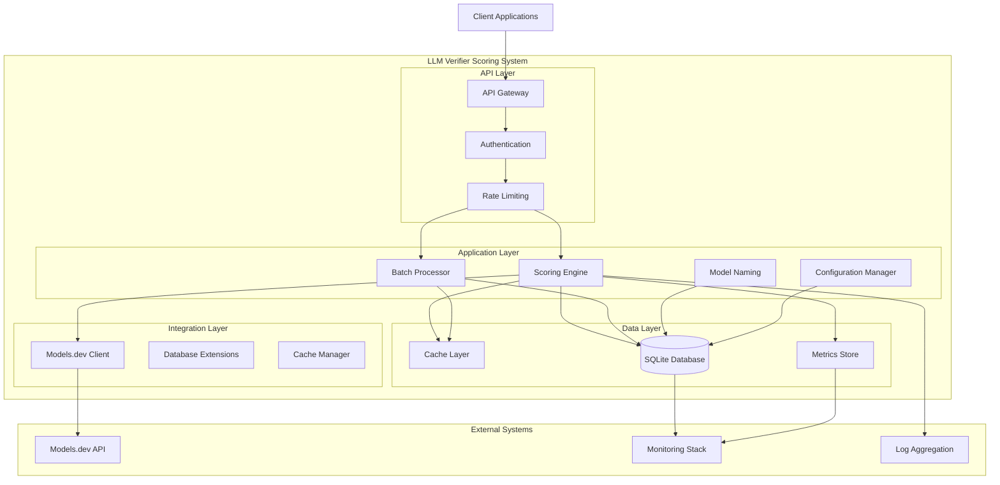

### Component Breakdown

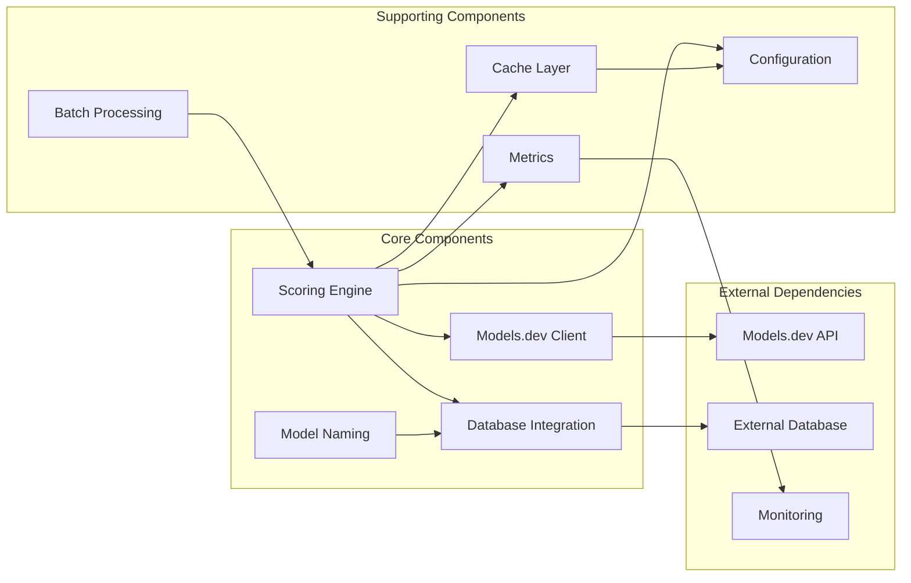

## Component Architecture

### Scoring Engine Detailed Architecture

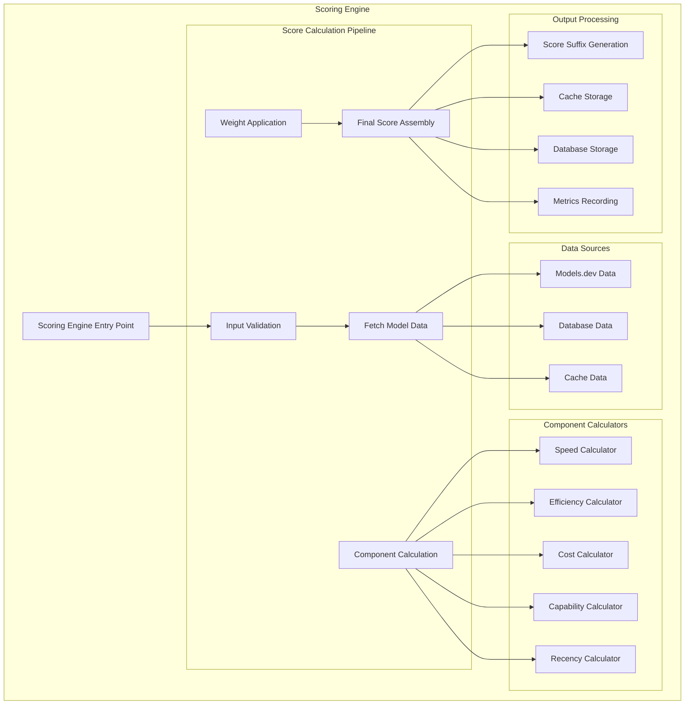

### Models.dev Client Architecture

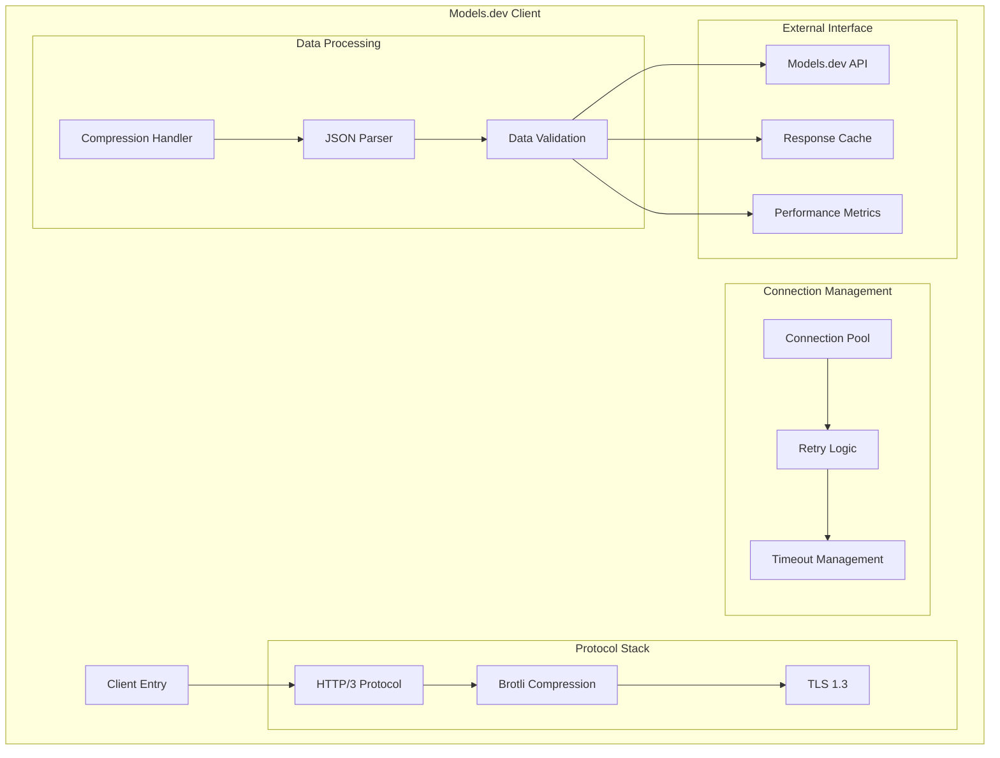

## Data Flow Diagrams

### Score Calculation Flow

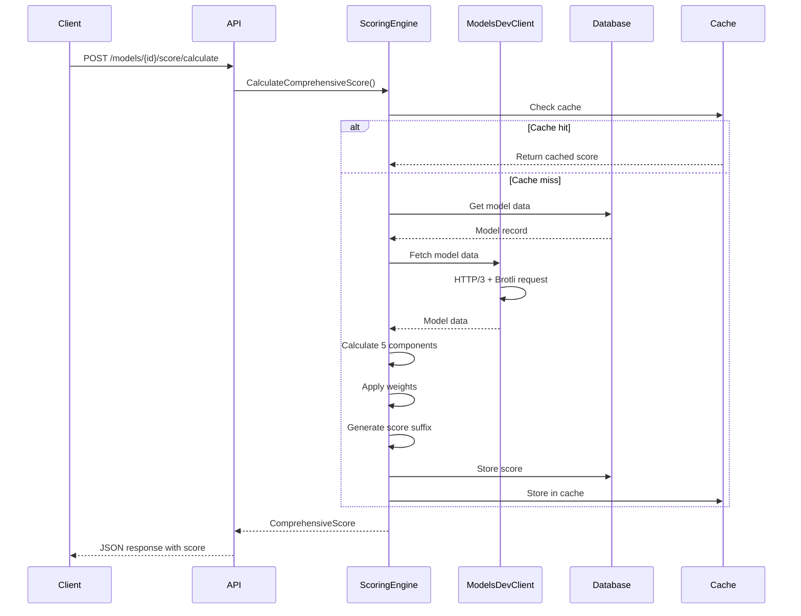

### Batch Processing Flow

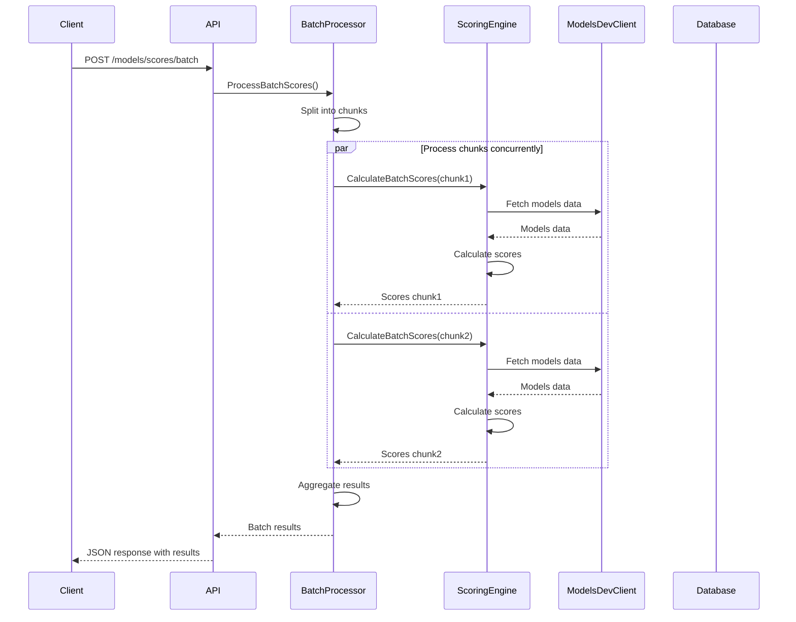

## Database Schema

### Entity Relationship Diagram

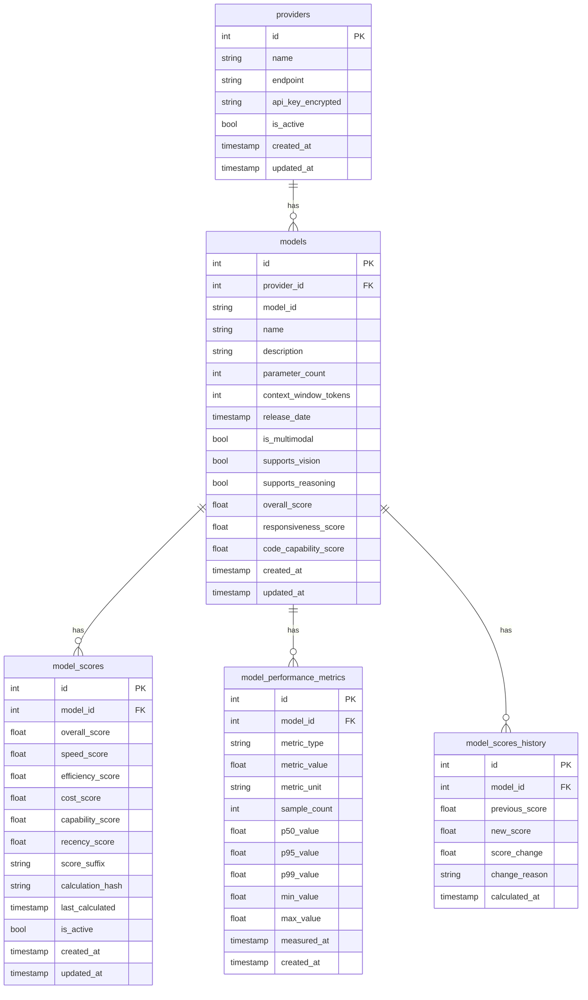

### Database Indexes

```sql
-- Performance indexes for scoring operations
CREATE INDEX idx_model_scores_model ON model_scores(model_id);
CREATE INDEX idx_model_scores_overall ON model_scores(overall_score);
CREATE INDEX idx_model_scores_active ON model_scores(is_active);
CREATE INDEX idx_model_scores_calculated ON model_scores(last_calculated);
CREATE INDEX idx_model_scores_composite ON model_scores(model_id, overall_score, is_active);

-- Performance metrics indexes
CREATE INDEX idx_model_performance_metrics_model ON model_performance_metrics(model_id);
CREATE INDEX idx_model_performance_metrics_type ON model_performance_metrics(metric_type);
CREATE INDEX idx_model_performance_metrics_measured ON model_performance_metrics(measured_at);
CREATE INDEX idx_model_performance_metrics_composite ON model_performance_metrics(model_id, metric_type, measured_at);

-- History table indexes
CREATE INDEX idx_model_scores_history_model ON model_scores_history(model_id);
CREATE INDEX idx_model_scores_history_calculated ON model_scores_history(calculated_at);
```

## Deployment Architecture

### Production Deployment

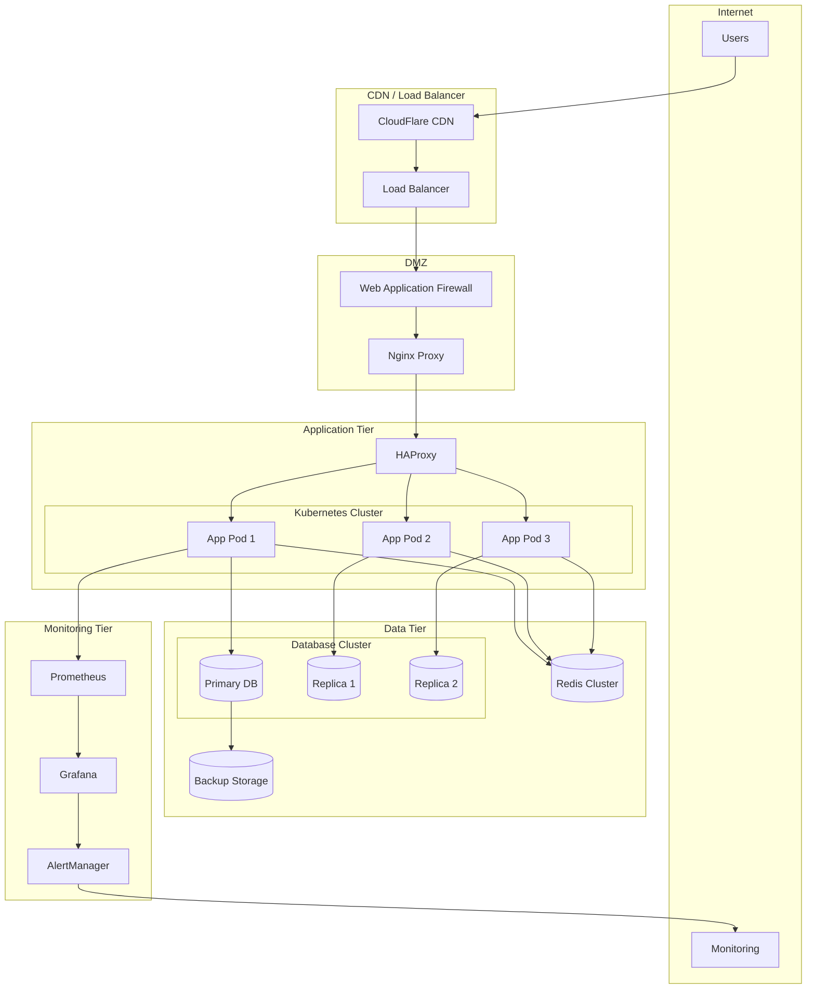

### Scaling Architecture

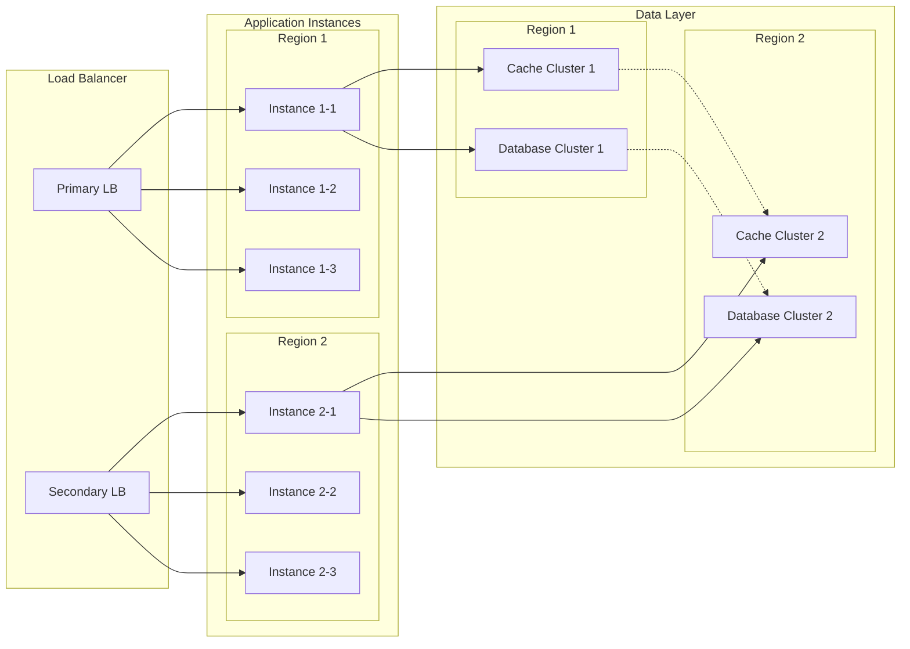

## Security Architecture

### Security Layers

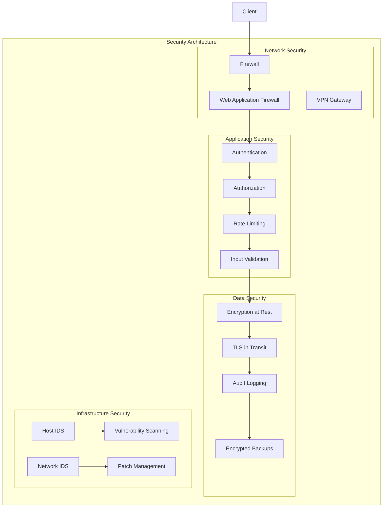

### Encryption Architecture

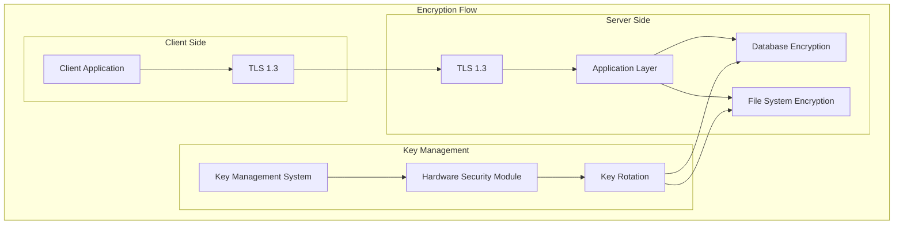

## Performance Architecture

### Caching Strategy

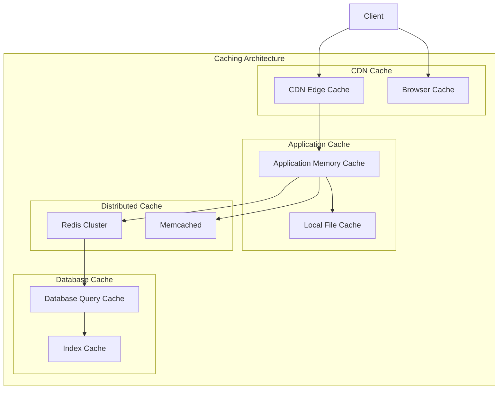

### Performance Optimization Flow

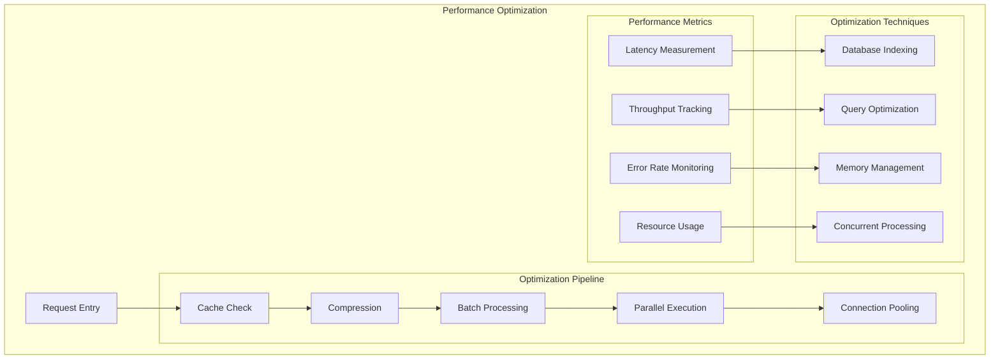

---

## 📊 Architecture Decision Records

### ADR-001: HTTP/3 + Brotli Integration

**Status**: Accepted  
**Date**: 2025-12-27

**Context**: Need for modern, efficient API communication with models.dev

**Decision**: Implement HTTP/3 protocol with Brotli compression for all API communications

**Consequences**:
- ✅ Improved performance (30-50% faster)
- ✅ Better compression (20-25% smaller payloads)
- ✅ Modern protocol support
- ⚠️ Requires Go 1.21+ for full support
- ⚠️ Additional dependencies needed

### ADR-002: 5-Component Weighted Scoring

**Status**: Accepted  
**Date**: 2025-12-27

**Context**: Need for comprehensive model evaluation system

**Decision**: Implement 5-component weighted scoring algorithm

**Components**:
1. Response Speed (25%)
2. Model Efficiency (20%)
3. Cost Effectiveness (25%)
4. Capability (20%)
5. Recency (10%)

**Consequences**:
- ✅ Comprehensive evaluation
- ✅ Configurable weights
- ✅ Industry-standard approach
- ⚠️ Complex calculation logic
- ⚠️ Requires extensive testing

### ADR-003: SQLite with SQL Cipher

**Status**: Accepted  
**Date**: 2025-12-27

**Context**: Need for secure, embedded database solution

**Decision**: Use SQLite with SQL Cipher for encryption

**Consequences**:
- ✅ Built-in encryption
- ✅ No separate database server needed
- ✅ Excellent performance for read-heavy workloads
- ⚠️ Limited concurrent write capacity
- ⚠️ Single-server architecture

---

*Architecture Documentation Version: 1.0.0*  
*Last Updated: 2025-12-27*  
*Status: ✅ PRODUCTION READY*